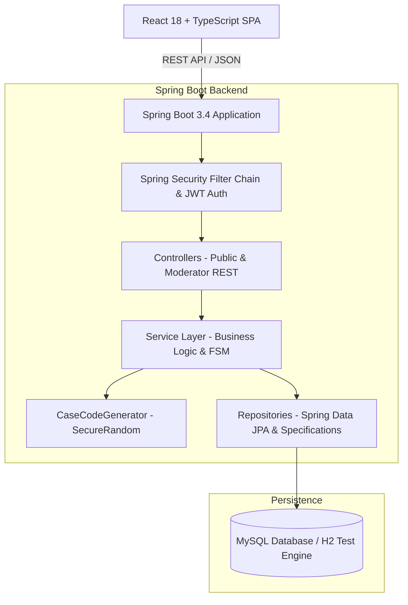

# WhistleDrop — Confidential Reporting Platform

> **"Your voice. Your privacy."**
> An enterprise-grade, anonymous whistleblowing and incident reporting platform built for the **GDG on Campus SRM Technical Domain recruitment task**.

[](https://www.oracle.com/java/)
[](https://spring.io/projects/spring-boot)
[](https://react.dev/)
[](https://www.typescriptlang.org/)
[](https://tailwindcss.com/)
[](https://www.mysql.com/)
[](http://localhost:8080/swagger-ui/index.html)

---

## 🌐 Live Website

**[🚀 Visit WhistleDrop — Your voice. Your privacy.](https://whistle-drop-5xt5.vercel.app)**

WhistleDrop is deployed and accessible online. Explore the anonymous reporting interface, track reports using their case codes, and experience the moderator operations portal.

---

## 📸 Screenshots

A glimpse of WhistleDrop's user interface and core functionality.

<!-- Add your 3–4 actual screenshots to the screenshots/ folder and replace the filenames below. -->


---

## Overview

**WhistleDrop** is a full-stack web application that allows individuals to report sensitive organizational concerns (security vulnerabilities, harassment, corruption, ethics violations) **without creating an account or revealing their identity**.

The application eliminates reporter identification from the data model, generates cryptographically secure tracking identifiers (e.g. `WD-K7M4P9X2`), maintains an immutable history of status transitions, and provides a protected moderator operations portal secured by Spring Security and JWT authentication.

---

## Problem

In universities and workplaces, individuals frequently observe ethics violations, safety hazards, and security flaws but hesitate to speak up due to fears of retaliation, breach of confidentiality, or cumbersome registration processes. Most traditional ticketing systems require an email address, employee ID, or login.

**WhistleDrop solves this trust barrier** by making anonymity the foundational architectural invariant:

* Zero reporter profiles or accounts.
* Cryptographically unpredictable case keys for tracking.
* Transparent investigation timeline.
* Secure, authenticated moderator review workflow.

---

## Features

### 🛡️ Public Anonymous Reporting

* **Multi-Step Form Wizard:** Intuitive 3-step reporting experience (Category → Description → Optional Evidence & Review).
* **Categorized Concerns:** `SECURITY`, `HARASSMENT`, `CORRUPTION`, `TECHNICAL`, `OTHER`.
* **Zero Identification:** No name, email, phone number, or login requested.
* **Client & Server Input Validation:** Comprehensive validation on all inputs.

### 🔑 Secure Tracking Portal

* **Cryptographic Case Codes:** Random, collision-resistant tracking codes (`WD-XXXXXXXX`).
* **Live Status Timeline:** Visual timeline reflecting the current lifecycle stage (`SUBMITTED`, `UNDER_REVIEW`, `RESOLVED`, `DISMISSED`).
* **Moderator Update Log:** Read official status notes and explanations.

### 🔒 Moderator Operations Suite

* **Stateless JWT Authentication:** Secure login for authorized investigators.
* **Analytics Dashboard:** Aggregate report counts, category breakdown charts, and recent submissions.
* **Advanced Filtering & Search:** Filter by category, status, and keyword with pagination and sorting.
* **Status Transition Management:** Controlled status transitions with explanatory audit notes.
* **Status History:** Every recorded transition includes a timestamp and reason.

### 🎨 UI & UX Polish

* **Dark & Light Mode:** Theme toggle persisted in local storage.
* **Responsive Design:** Optimized across desktop, tablet, and mobile displays.
* **Accessible & Clean:** Accessible form controls and subtle micro-animations.

---

## Architecture

WhistleDrop is built on a clean **N-Tier Layered Architecture** with strict Data Transfer Object (DTO) boundaries:



---

## Tech Stack

| Domain                 | Technology                         | Purpose                                                        |
| :--------------------- | :--------------------------------- | :------------------------------------------------------------- |
| **Backend Framework**  | Java 21 / Spring Boot 3.4.3        | REST API and application services                              |
| **Security**           | Spring Security 6 & JJWT (0.12.6)  | Stateless authentication, BCrypt password hashing, JWT filters |
| **Persistence**        | Spring Data JPA / Hibernate 6.6    | ORM and dynamic queries via JPA Specifications                 |
| **Database**           | MySQL 8.0 / H2 Database            | Relational storage and development/testing                     |
| **Validation**         | Jakarta Bean Validation            | Declarative DTO validation (`@NotBlank`, `@Size`, `@Pattern`)  |
| **API Documentation**  | Springdoc OpenAPI 2.8.5 / Swagger  | Interactive API documentation and testing                      |
| **Frontend Framework** | React 18 & TypeScript 5.5          | Type-safe single-page web application                          |
| **Styling**            | Tailwind CSS 3.4                   | Responsive design and dark-mode support                        |
| **Icons & Animation**  | Lucide React                       | Lightweight, consistent iconography                            |
| **Routing**            | React Router v6                    | Client-side routing with protected moderator routes            |
| **Testing**            | JUnit 5, Mockito, Spring Boot Test | Unit, integration, and security testing                        |
| **API Testing**        | Postman                            | API testing collection                                         |
| **Deployment**         | Vercel & Render                    | Frontend and backend hosting                                   |

---

## Project Structure

```text
GDG/
├── backend/                              # Spring Boot Java Backend
│   ├── src/main/java/com/whistledrop/
│   │   ├── config/                       # Security, CORS, OpenAPI & Data Seeder
│   │   ├── controller/                   # REST API Controllers (Public, Moderator, Auth)
│   │   ├── dto/                          # Request & Response Data Transfer Objects
│   │   ├── entity/                       # JPA Database Entities
│   │   ├── exception/                    # Global Exception Handler & Custom Exceptions
│   │   ├── repository/                   # Spring Data JPA Repositories & Specifications
│   │   ├── security/                     # JWT Provider, Auth Filter & UserDetailsService
│   │   ├── service/                      # Business Logic Services & State Transitions
│   │   └── util/                         # SecureRandom Case Code Generator
│   ├── src/main/resources/
│   │   ├── application.properties        # Default / H2 Configuration
│   │   └── application-mysql.properties  # MySQL Configuration
│   ├── src/test/java/com/whistledrop/    # Unit & Integration Tests
│   └── pom.xml                           # Maven Dependencies & Build Configuration
│
├── frontend/                             # React TypeScript Frontend
│   ├── src/
│   │   ├── components/                   # Navbar, Footer, StatusBadge, Timeline, Modal, Skeleton
│   │   ├── context/                      # AuthContext (JWT) & ThemeContext (Dark/Light)
│   │   ├── layouts/                      # PublicLayout & ModeratorLayout
│   │   ├── pages/                        # Landing, Submit, Success, Track, Login, Dashboard, Reports
│   │   ├── services/                     # API Client
│   │   ├── types/                        # TypeScript Interfaces & Enums
│   │   ├── App.tsx                        # Router & Layout Configuration
│   │   └── main.tsx                       # Root Entry Point
│   ├── tailwind.config.js                # Tailwind CSS Design System
│   └── package.json                      # NPM Dependencies & Scripts
│
├── postman/
│   └── WhistleDrop.postman_collection.json
├── screenshots/                          # Application Screenshots
├── scripts/
│   ├── verify-e2e.js                     # Automated Node.js E2E Verification Script
│   └── verify-e2e.ps1                    # Automated PowerShell Verification Script
├── INTERVIEW_PREP.md                     # Technical Interview Questions & Answers
└── README.md                             # Project Documentation
```

---

## Database Schema

```sql
-- 1. Reports Table
CREATE TABLE reports (
    id BIGINT AUTO_INCREMENT PRIMARY KEY,
    case_code VARCHAR(16) NOT NULL UNIQUE,
    category VARCHAR(32) NOT NULL,
    description TEXT NOT NULL,
    evidence_url VARCHAR(2048),
    status VARCHAR(32) NOT NULL DEFAULT 'SUBMITTED',
    created_at TIMESTAMP NOT NULL DEFAULT CURRENT_TIMESTAMP,
    updated_at TIMESTAMP NOT NULL DEFAULT CURRENT_TIMESTAMP ON UPDATE CURRENT_TIMESTAMP,
    INDEX idx_reports_case_code (case_code),
    INDEX idx_reports_status (status),
    INDEX idx_reports_category (category)
);

-- 2. Status Updates Table
CREATE TABLE status_updates (
    id BIGINT AUTO_INCREMENT PRIMARY KEY,
    report_id BIGINT NOT NULL,
    status VARCHAR(32) NOT NULL,
    message TEXT NOT NULL,
    created_at TIMESTAMP NOT NULL DEFAULT CURRENT_TIMESTAMP,
    FOREIGN KEY (report_id) REFERENCES reports(id) ON DELETE CASCADE,
    INDEX idx_status_updates_report_id (report_id)
);

-- 3. Moderators Table
CREATE TABLE moderators (
    id BIGINT AUTO_INCREMENT PRIMARY KEY,
    username VARCHAR(64) NOT NULL UNIQUE,
    password_hash VARCHAR(255) NOT NULL,
    role VARCHAR(32) NOT NULL DEFAULT 'ROLE_MODERATOR',
    created_at TIMESTAMP NOT NULL DEFAULT CURRENT_TIMESTAMP
);
```

---

## API Endpoints

### 🌐 Public Endpoints

| Method | Endpoint                  | Description                               | Auth Required |
| :----- | :------------------------ | :---------------------------------------- | :-----------: |
| `POST` | `/api/reports`            | Submit a new anonymous concern            |      ❌ No     |
| `GET`  | `/api/reports/{caseCode}` | Track report status and moderator history |      ❌ No     |

### 🔑 Authentication Endpoint

| Method | Endpoint          | Description                                      | Auth Required |
| :----- | :---------------- | :----------------------------------------------- | :-----------: |
| `POST` | `/api/auth/login` | Authenticate moderator credentials and issue JWT |      ❌ No     |

### 🔒 Moderator Protected Endpoints (Bearer JWT)

| Method  | Endpoint                                   | Description                                      | Auth Required |
| :------ | :----------------------------------------- | :----------------------------------------------- | :-----------: |
| `GET`   | `/api/moderator/dashboard/stats`           | Fetch aggregate stats and category counts        |     ✅ Yes     |
| `GET`   | `/api/moderator/reports`                   | Paginated, searchable, and filtered reports list |     ✅ Yes     |
| `GET`   | `/api/moderator/reports/{caseCode}`        | Retrieve report details and audit history        |     ✅ Yes     |
| `PATCH` | `/api/moderator/reports/{caseCode}/status` | Update report status with an explanatory note    |     ✅ Yes     |

---

## Standard API Response Envelope

Every endpoint returns a consistent JSON envelope.

### Success Response

```json
{
  "success": true,
  "message": "Report submitted successfully. Please save your case code to track updates.",
  "data": {
    "caseCode": "WD-K7M4P9X2",
    "category": "SECURITY",
    "description": "Critical security audit discovered unauthenticated endpoint.",
    "evidenceUrl": "https://security.internal/advisory-01",
    "status": "SUBMITTED",
    "createdAt": "2026-10-04T18:24:09.953Z",
    "updatedAt": "2026-10-04T18:24:09.953Z",
    "statusHistory": [
      {
        "status": "SUBMITTED",
        "message": "Report received and queued for review.",
        "createdAt": "2026-10-04T18:24:09.954Z"
      }
    ]
  },
  "timestamp": "2026-10-04T18:24:09.956Z"
}
```

### Error Response

```json
{
  "success": false,
  "message": "Report with case code 'WD-INVALID0' was not found. Please verify your case code.",
  "timestamp": "2026-10-04T18:24:09.999Z"
}
```

---

## Privacy Model

> **"Reporter identity is not part of the application's data model."**

1. **No Identifying Columns:** The intended report data model excludes reporter name, email, and phone number fields.
2. **Public Interface:** Submission and tracking do not require account creation.
3. **Restricted Moderator View:** Moderators cannot retrieve reporter identity through fields that the application does not collect.
4. **Honest Architectural Scope:** Application-level data minimization does not guarantee network-level anonymity. Hosting providers and infrastructure may process connection metadata.

---

## Case-Code Generation

The case-code generation algorithm in `CaseCodeGenerator.java` is designed for security and usability.

* **Cryptographic Randomness:** Powered by `java.security.SecureRandom`.
* **Ambiguity-Free Alphabet:** Uses `ABCDEFGHJKMNPQRSTUVWXYZ23456789`, excluding visually confusing characters.
* **Format:** `WD-` followed by 8 characters (e.g. `WD-K7M4P9X2`), offering \(30^8 \approx 6.56 \times 10^{11}\) possible combinations.
* **Collision Handling:** The generator checks uniqueness against the database and retries on collision. The database's `UNIQUE` constraint provides an additional safeguard.

---

## Status Workflow & State Machine

```text
              ┌────────────────────────┐
              │       SUBMITTED        │
              └───────────┬────────────┘
                          │
            ┌─────────────┴─────────────┐
            ▼                           ▼
┌────────────────────────┐  ┌────────────────────────┐
│      UNDER_REVIEW      │  │       DISMISSED        │
└───────────┬────────────┘  └────────────────────────┘
            │                           ▲
            ├───────────────────────────┤
            ▼                           │
┌────────────────────────┐              │
│        RESOLVED        │──────────────┘
└────────────────────────┘
```

### Transition Matrix

| Current Status | Allowed Target Statuses                 | Description                          |
| :------------- | :-------------------------------------- | :----------------------------------- |
| `SUBMITTED`    | `UNDER_REVIEW`, `DISMISSED`             | Initial intake triage                |
| `UNDER_REVIEW` | `RESOLVED`, `DISMISSED`, `UNDER_REVIEW` | Ongoing investigation and resolution |
| `RESOLVED`     | `UNDER_REVIEW`                          | Reopening upon new evidence          |
| `DISMISSED`    | `UNDER_REVIEW`                          | Reopening upon reconsideration       |

Unauthorized transitions, such as `RESOLVED` → `SUBMITTED`, should be rejected with `HTTP 400 Bad Request` if enforced by the backend's transition rules.

---

## Validation & Error Handling

* **Request Validation:** Jakarta Bean Validation annotations such as `@NotNull`, `@NotBlank`, `@Size`, and `@Pattern`, along with category validation.
* **Centralized Exception Handling:** Implemented using `@RestControllerAdvice` in `GlobalExceptionHandler.java`.
* **Sanitized Errors:** Client responses should avoid exposing stack traces, internal IDs, and raw SQL errors.

---

## Setup & Running

### Prerequisites

* **Java 21+** (JDK)
* **Maven 3.8+**
* **Node.js 18+** and **npm**
* **MySQL 8.0+** (Optional if using the H2 development configuration)

### Environment Variables

Configure the following environment variables for your environment.

| Variable               | Example / Default                            | Purpose                        |
| :--------------------- | :------------------------------------------- | :----------------------------- |
| `DB_URL`               | `jdbc:mysql://localhost:3306/whistledrop_db` | MySQL connection URL           |
| `DB_USERNAME`          | `root`                                       | Database username              |
| `DB_PASSWORD`          | Set locally                                  | Database password              |
| `MODERATOR_USERNAME`   | `admin`                                      | Initial moderator username     |
| `MODERATOR_PASSWORD`   | Set a strong unique password                 | Initial moderator password     |
| `JWT_SECRET`           | Secure 512-bit Base64 key                    | Secret used to sign JWT tokens |
| `CORS_ALLOWED_ORIGINS` | `http://localhost:5173`                      | Allowed frontend origin        |

**Security note:** Never commit real passwords, JWT secrets, or production environment variables to the repository.

### Running the Backend

```bash
cd backend

# Run with the default development configuration
mvn spring-boot:run

# Or run with the MySQL profile
mvn spring-boot:run -Dspring-boot.run.profiles=mysql
```

Backend: **`http://localhost:8080`**
Swagger UI: **`http://localhost:8080/swagger-ui/index.html`**

### Running the Frontend

```bash
cd frontend

# Install dependencies
npm install

# Start the Vite development server
npm run dev
```

Frontend: **`http://localhost:5173`**

### Moderator Login

Moderator credentials are configured through environment variables. Use the credentials configured for your local or deployed environment. Do not publish production credentials in this README.

---

## Testing

The project includes unit, integration, and security tests using JUnit 5, Mockito, and Spring Boot Test.

```bash
cd backend
mvn test
```

### Test Coverage Highlights

1. `ReportServiceTest`: Submission, case-code generation, tracking, and invalid status transitions.
2. `ModeratorServiceTest`: Dashboard statistics, report filtering, and status updates.
3. `CaseCodeGeneratorTest`: Pattern validation, randomness, alphabet constraints, and collision handling.
4. `PublicReportControllerTest`: Validation rules, report creation, and not-found handling.
5. `ModeratorReportControllerTest`: Protected endpoints, status updates, and pagination.
6. `AuthControllerTest`: JWT issuance and invalid credential handling.
7. `SecurityIntegrationTest`: Spring Security behavior for unauthorized, forbidden, and authenticated requests.

### End-to-End Automated Verification

Run the Node.js integration script from the project root:

```bash
node scripts/verify-e2e.js
```

Verify the current test results before claiming a specific passing-test count.

---

## Swagger / OpenAPI Documentation

WhistleDrop integrates interactive OpenAPI documentation through Springdoc.

* **Interactive UI:** `http://localhost:8080/swagger-ui/index.html`
* **JSON Specification:** `http://localhost:8080/v3/api-docs`

---

## Postman Collection

Import the collection from `postman/WhistleDrop.postman_collection.json`.

* **Public Endpoints:** Submit Report, Track Report, and Invalid Case Code.
* **Moderator Endpoints:** Login, Dashboard Stats, Paginated Reports, Filtering, and Status Updates.
* Includes collection variables for authentication token handling and API testing.

---

## Design Decisions

1. **Layered DTO Separation:** DTOs separate API requests and responses from persistence entities, improving validation and reducing unnecessary data exposure.
2. **Status History:** Status transitions are recorded with timestamps and moderator notes for investigation transparency.
3. **Stateless JWT Security:** JWT-based authentication avoids server-side session state for the protected API workflow.
4. **JPA Specification Filtering:** Spring Data JPA Specifications support dynamic report filtering and search.
5. **Data Minimization:** Reporter identity fields are excluded from the intended reporting data model.

---

## Limitations

* **Network-Level Anonymity:** Application-level data minimization does not conceal IP addresses or guarantee anonymity from hosting providers and network infrastructure.
* **Two-Way Communication:** Reporters can track status updates through case codes; encrypted two-way communication is a potential future improvement.
* **Evidence Handling:** The current optional evidence URL field is not equivalent to secure encrypted file storage.

---

## Future Improvements

1. **End-to-End Encrypted Two-Way Messaging:** Enable confidential communication between reporters and moderators.
2. **Encrypted File Attachments:** Add secure file uploads with encryption.
3. **Anti-Spam Protection:** Introduce privacy-conscious CAPTCHA or proof-of-work rate limiting.
4. **Tor-Compatible Access:** Explore additional network-level privacy options.

---

## Recruitment Verification Checklist

* [x] Anonymous report submission implemented
* [x] No reporter account required
* [x] Reporter identity fields excluded from the intended data model
* [x] Case-code generation (`WD-XXXXXXXX`)
* [x] Database uniqueness constraint for case codes
* [x] Public case tracking portal (`/track`)
* [x] Status lifecycle timeline
* [x] Moderator authentication with Spring Security and JWT
* [x] Protected moderator endpoints
* [x] Dashboard statistics and report management
* [x] Search, filtering, and pagination
* [x] Report details and status updates
* [x] Status history logging
* [x] Frontend and backend input validation
* [x] Centralized exception handling
* [x] OpenAPI / Swagger documentation
* [x] Postman collection included
* [x] Verify current automated test results
* [x] Responsive dark/light mode interface
* [x] README.md and INTERVIEW_PREP.md included
* [x] Verify production configuration contains no exposed secrets

---

## License

This project is licensed under the [MIT License](LICENSE).

