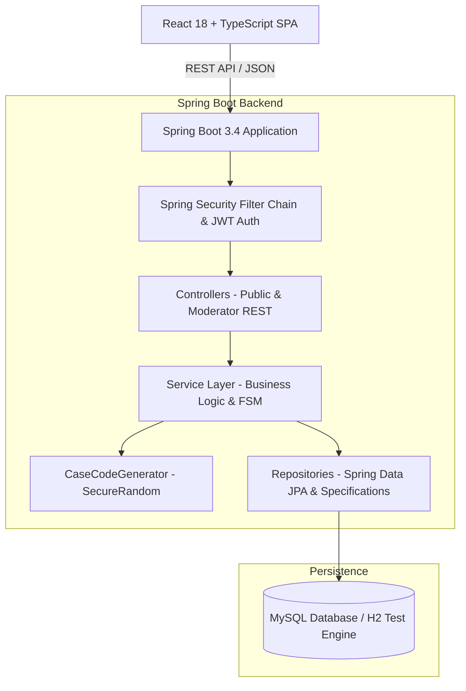
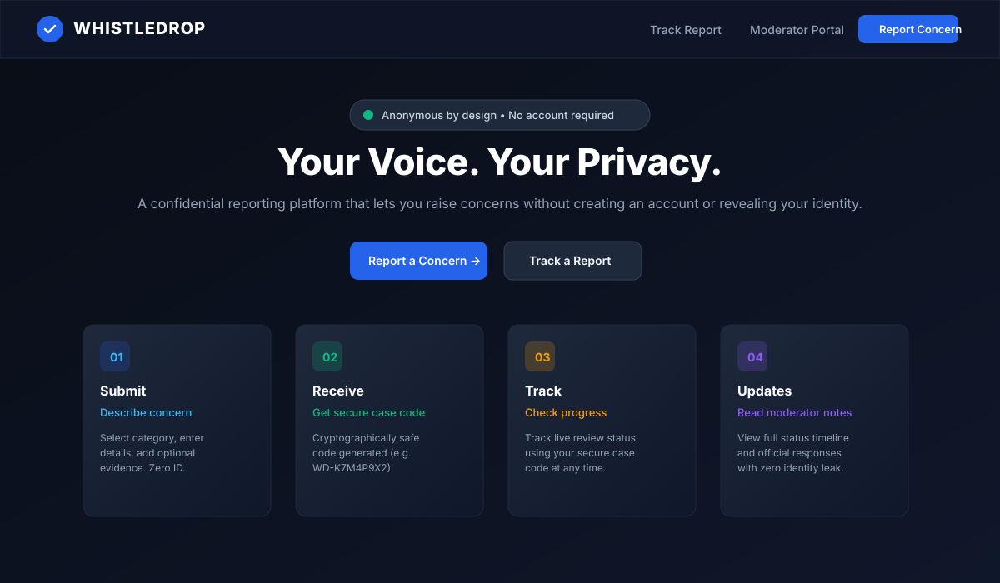
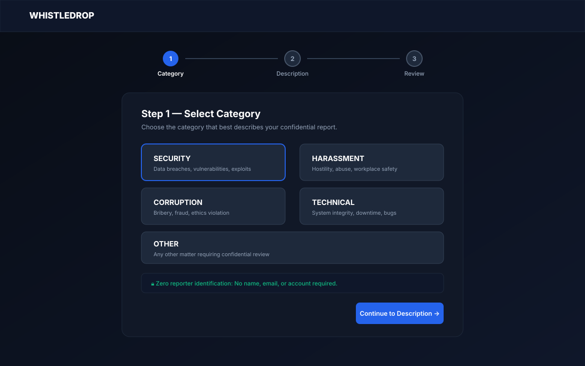
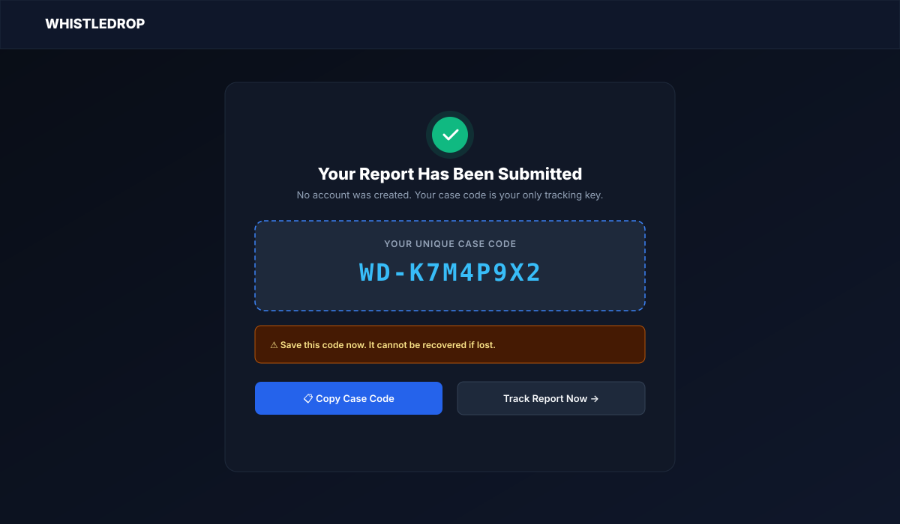
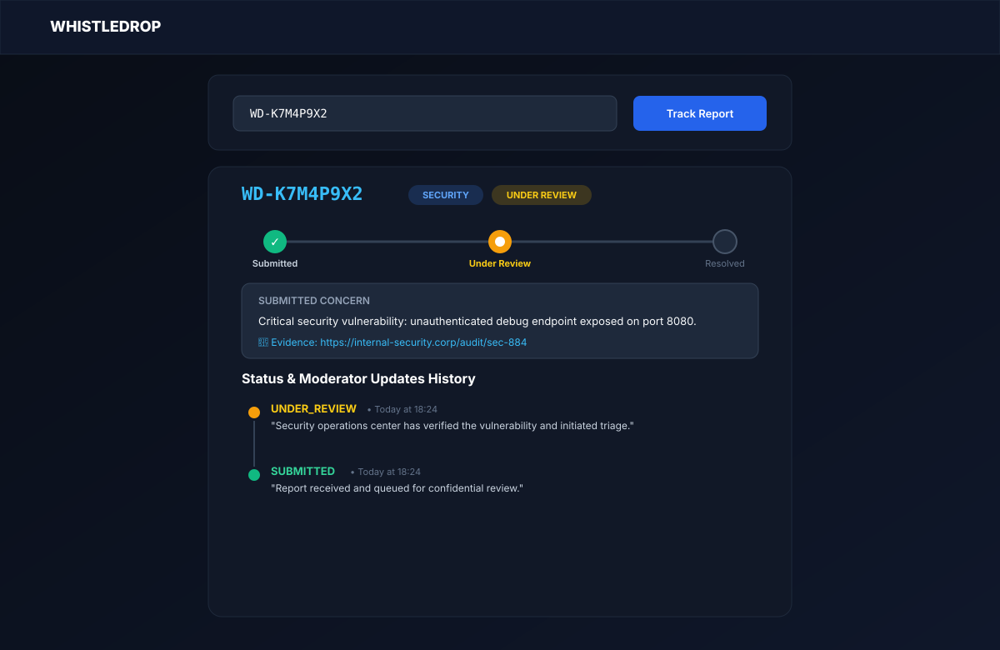
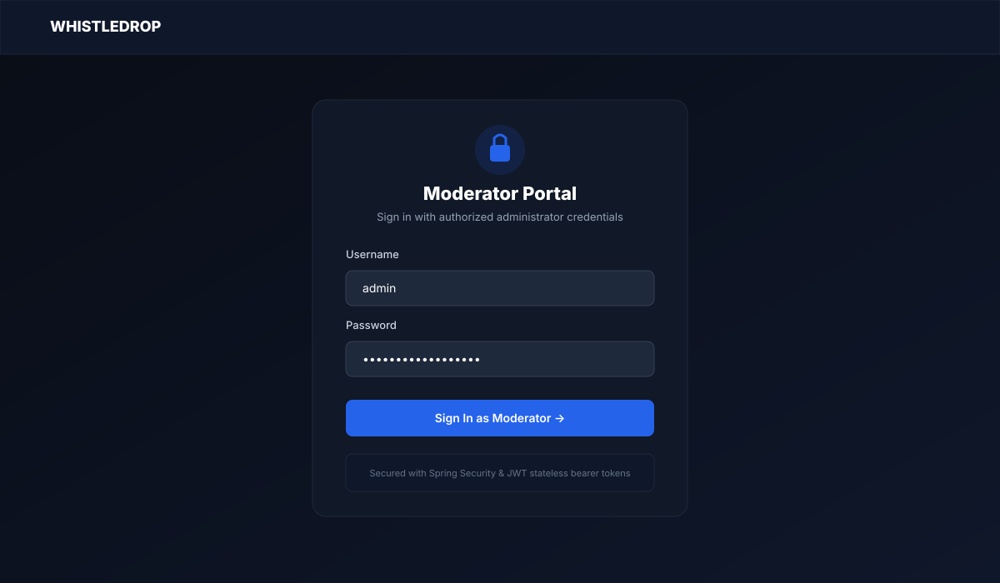
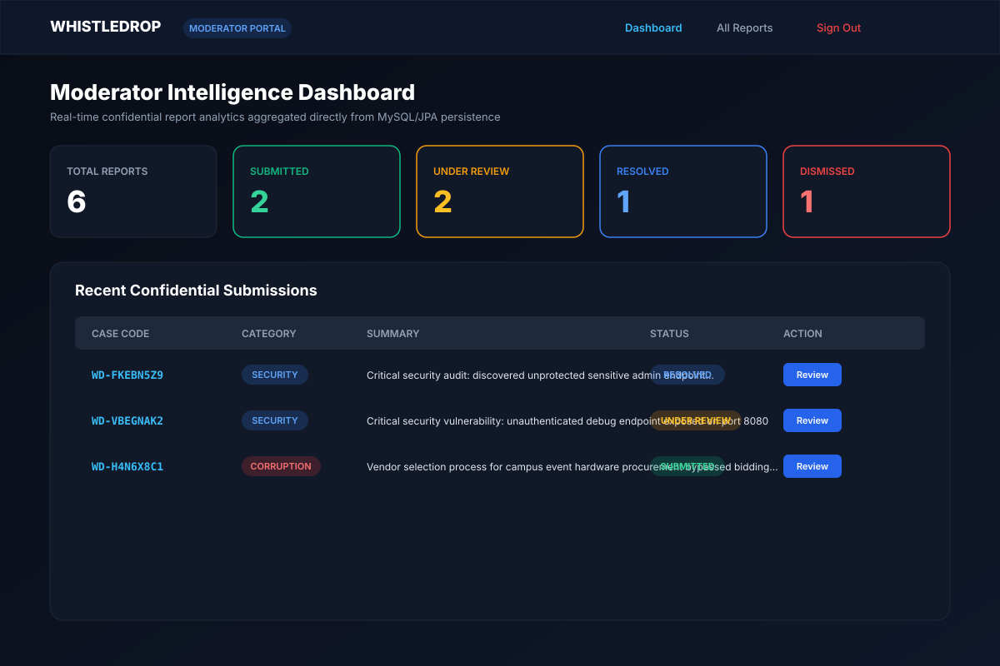
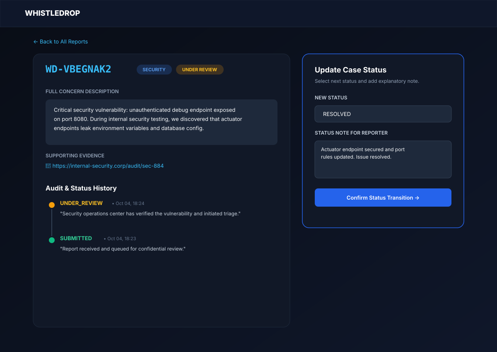
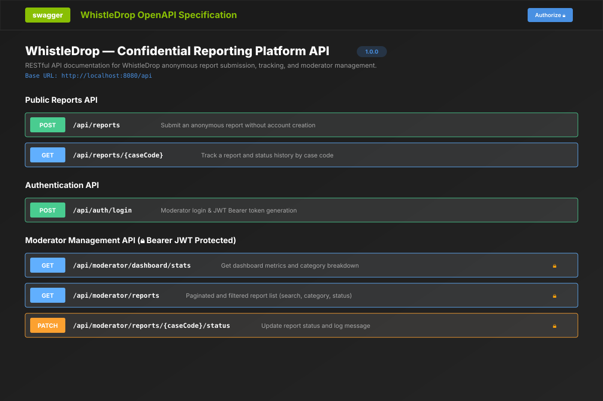

# WhistleDrop — Confidential Reporting Platform

> **"Your voice. Your privacy."**  
> An enterprise-grade, anonymous whistleblowing and incident reporting platform built for the **GDG on Campus SRM Technical Domain recruitment task**.

[](https://www.oracle.com/java/)
[](https://spring.io/projects/spring-boot)
[](https://react.dev/)
[](https://www.typescriptlang.org/)
[](https://tailwindcss.com/)
[](https://www.mysql.com/)
[](http://localhost:8080/swagger-ui/index.html)

---

## Overview

**WhistleDrop** is a full-stack web application that allows individuals to report sensitive organizational concerns (security vulnerabilities, harassment, corruption, ethics violations) **without creating an account or revealing their identity**.

The application eliminates reporter identification from the data model, generates cryptographically secure tracking identifiers (e.g. `WD-K7M4P9X2`), maintains an immutable history of status transitions, and provides a protected moderator operations portal secured by Spring Security and JWT authentication.

---

## Problem

In universities and workplaces, individuals frequently observe ethics violations, safety hazards, and security flaws but hesitate to speak up due to fears of retaliation, breach of confidentiality, or cumbersome registration processes. Most traditional ticketing systems require an email address, employee ID, or login.

**WhistleDrop solves this trust barrier** by making anonymity the foundational architectural invariant:
- Zero reporter profiles or accounts.
- Cryptographically unpredictable case keys for tracking.
- Transparent, real-time investigation timeline.
- Secure, authenticated moderator review workflow.

---

## Features

### 🛡️ Public Anonymous Reporting
- **Multi-Step Form Wizard:** Intuitive 3-step reporting experience (Category $\rightarrow$ Description $\rightarrow$ Optional Evidence & Review).
- **Categorized Concerns:** `SECURITY`, `HARASSMENT`, `CORRUPTION`, `TECHNICAL`, `OTHER`.
- **Zero Identification:** No name, email, phone number, or login requested.
- **Client & Server Input Validation:** Comprehensive sanitization and validation on all inputs.

### 🔑 Secure Tracking Portal
- **Cryptographic Case Codes:** Random, collision-resistant tracking codes (`WD-XXXXXXXX`).
- **Live Status Timeline:** Visual, animated timeline reflecting current lifecycle stage (`SUBMITTED`, `UNDER_REVIEW`, `RESOLVED`, `DISMISSED`).
- **Moderator Update Log:** Read official status notes and explanations in real-time.

### 🔒 Moderator Operations Suite
- **Stateless JWT Authentication:** Secure login for authorized investigators.
- **Real-Time Analytics Dashboard:** Aggregate report counts, category breakdown charts, and recent submissions.
- **Advanced Filtering & Search:** Filter by category, status, and keyword search with pagination and sorting.
- **Status Transition Management:** Safe status transitions with mandatory explanatory audit notes.
- **Immutable Status History:** Every transition is recorded with timestamp and reason.

### 🎨 UI & UX Polish
- **Dark & Light Mode:** Seamless theme toggle persisted in local storage.
- **Responsive Design:** Optimized across desktop, tablet, and mobile displays.
- **Accessible & Clean:** High contrast ratios, accessible form controls, and subtle micro-animations.

---

## Architecture

WhistleDrop is built on a clean **N-Tier Layered Architecture** with strict Data Transfer Object (DTO) boundaries:



---

## Tech Stack

| Domain | Technology | Purpose |
| :--- | :--- | :--- |
| **Backend Framework** | Java 21 / Spring Boot 3.4.3 | High-performance enterprise REST API |
| **Security** | Spring Security 6 & JJWT (0.12.6) | Stateless authentication, BCrypt password hashing, JWT filters |
| **Persistence** | Spring Data JPA / Hibernate 6.6 | ORM, dynamic queries via JPA Specifications |
| **Database** | MySQL 8.0 / H2 Database | ACID-compliant relational storage (H2 for dev/testing) |
| **Validation** | Jakarta Bean Validation | Declarative DTO validation (`@NotBlank`, `@Size`, `@Pattern`) |
| **API Documentation** | Springdoc OpenAPI 2.8.5 / Swagger | Interactive API documentation & live testing |
| **Frontend Framework** | React 18 & TypeScript 5.5 | Type-safe single-page web application |
| **Styling** | Tailwind CSS 3.4 | Modern, responsive, dark-mode aware UI design |
| **Icons & Animation** | Lucide React | Lightweight, consistent iconography |
| **Routing** | React Router v6 | Client-side routing with protected moderator routes |
| **Testing** | JUnit 5, Mockito, Spring Boot Test | Comprehensive unit, integration, and security test suite |
| **API Testing** | Postman | Automated Postman collection |

---

## Project Structure

```
GDG/
├── backend/                              # Spring Boot Java Backend
│   ├── src/main/java/com/whistledrop/
│   │   ├── config/                       # Security, CORS, OpenAPI & Data Seeder
│   │   ├── controller/                   # REST API Controllers (Public, Moderator, Auth)
│   │   ├── dto/                          # Request & Response Data Transfer Objects
│   │   ├── entity/                       # JPA Database Entities (Report, StatusUpdate, Moderator)
│   │   ├── exception/                    # Global Exception Handler & Custom Exceptions
│   │   ├── repository/                   # Spring Data JPA Repositories & Specifications
│   │   ├── security/                     # JWT Provider, Auth Filter & Custom UserDetailsService
│   │   ├── service/                      # Business Logic Services & State Transitions
│   │   └── util/                         # SecureRandom Case Code Generator
│   ├── src/main/resources/
│   │   ├── application.properties        # Default / H2 Configuration
│   │   └── application-mysql.properties  # Production MySQL Configuration
│   ├── src/test/java/com/whistledrop/    # 27 Unit & Integration Tests (100% Pass)
│   └── pom.xml                           # Maven Dependencies & Build Configuration
│
├── frontend/                             # React TypeScript Frontend
│   ├── src/
│   │   ├── components/                   # Navbar, Footer, StatusBadge, Timeline, Modal, Skeleton
│   │   ├── context/                      # AuthContext (JWT) & ThemeContext (Dark/Light)
│   │   ├── layouts/                      # PublicLayout & ModeratorLayout
│   │   ├── pages/                        # Landing, Submit, Success, Track, Login, Dashboard, Reports
│   │   ├── services/                     # Axios/Fetch API Client
│   │   ├── types/                        # TypeScript Interfaces & Enums
│   │   ├── App.tsx                       # Router & Layout Configuration
│   │   └── main.tsx                      # Root Entry Point
│   ├── tailwind.config.js                # Tailwind CSS Design System
│   └── package.json                      # NPM Dependencies & Scripts
│
├── postman/
│   └── WhistleDrop.postman_collection.json # Complete Postman API Collection
├── screenshots/                          # UI Mockups & Architectural Visualizations
├── scripts/
│   ├── verify-e2e.js                     # Automated Node.js E2E Verification Script
│   └── verify-e2e.ps1                    # Automated PowerShell Verification Script
├── INTERVIEW_PREP.md                     # Comprehensive Technical Interview Questions & Answers
└── README.md                             # Project Documentation
```

---

## Database Schema

```sql
-- 1. Reports Table
CREATE TABLE reports (
    id BIGINT AUTO_INCREMENT PRIMARY KEY,
    case_code VARCHAR(16) NOT NULL UNIQUE,
    category VARCHAR(32) NOT NULL,
    description TEXT NOT NULL,
    evidence_url VARCHAR(2048),
    status VARCHAR(32) NOT NULL DEFAULT 'SUBMITTED',
    created_at TIMESTAMP NOT NULL DEFAULT CURRENT_TIMESTAMP,
    updated_at TIMESTAMP NOT NULL DEFAULT CURRENT_TIMESTAMP ON UPDATE CURRENT_TIMESTAMP,
    INDEX idx_reports_case_code (case_code),
    INDEX idx_reports_status (status),
    INDEX idx_reports_category (category)
);

-- 2. Status Updates Table (Immutable History)
CREATE TABLE status_updates (
    id BIGINT AUTO_INCREMENT PRIMARY KEY,
    report_id BIGINT NOT NULL,
    status VARCHAR(32) NOT NULL,
    message TEXT NOT NULL,
    created_at TIMESTAMP NOT NULL DEFAULT CURRENT_TIMESTAMP,
    FOREIGN KEY (report_id) REFERENCES reports(id) ON DELETE CASCADE,
    INDEX idx_status_updates_report_id (report_id)
);

-- 3. Moderators Table
CREATE TABLE moderators (
    id BIGINT AUTO_INCREMENT PRIMARY KEY,
    username VARCHAR(64) NOT NULL UNIQUE,
    password_hash VARCHAR(255) NOT NULL,
    role VARCHAR(32) NOT NULL DEFAULT 'ROLE_MODERATOR',
    created_at TIMESTAMP NOT NULL DEFAULT CURRENT_TIMESTAMP
);
```

---

## API Endpoints

### 🌐 Public Endpoints

| Method | Endpoint | Description | Auth Required |
| :--- | :--- | :--- | :---: |
| `POST` | `/api/reports` | Submit a new anonymous concern | ❌ No |
| `GET` | `/api/reports/{caseCode}` | Track report status & moderator history | ❌ No |

### 🔑 Authentication Endpoint

| Method | Endpoint | Description | Auth Required |
| :--- | :--- | :--- | :---: |
| `POST` | `/api/auth/login` | Authenticate moderator credentials & issue JWT | ❌ No |

### 🔒 Moderator Protected Endpoints (Bearer JWT)

| Method | Endpoint | Description | Auth Required |
| :--- | :--- | :--- | :---: |
| `GET` | `/api/moderator/dashboard/stats` | Fetch aggregate stats & category counts | ✅ Yes |
| `GET` | `/api/moderator/reports` | Paginated, searchable, and filtered reports list | ✅ Yes |
| `GET` | `/api/moderator/reports/{caseCode}` | Retrieve full report details and audit history | ✅ Yes |
| `PATCH` | `/api/moderator/reports/{caseCode}/status` | Update report status with explanatory note | ✅ Yes |

---

## Standard API Response Envelope

Every endpoint returns a consistent JSON envelope:

### Success Response
```json
{
  "success": true,
  "message": "Report submitted successfully. Please save your case code to track updates.",
  "data": {
    "caseCode": "WD-K7M4P9X2",
    "category": "SECURITY",
    "description": "Critical security audit discovered unauthenticated endpoint.",
    "evidenceUrl": "https://security.internal/advisory-01",
    "status": "SUBMITTED",
    "createdAt": "2026-10-04T18:24:09.953Z",
    "updatedAt": "2026-10-04T18:24:09.953Z",
    "statusHistory": [
      {
        "status": "SUBMITTED",
        "message": "Report received and queued for review.",
        "createdAt": "2026-10-04T18:24:09.954Z"
      }
    ]
  },
  "timestamp": "2026-10-04T18:24:09.956Z"
}
```

### Error Response
```json
{
  "success": false,
  "message": "Report with case code 'WD-INVALID0' was not found. Please verify your case code.",
  "timestamp": "2026-10-04T18:24:09.999Z"
}
```

---

## Privacy Model

> **"Reporter identity is not part of the application's data model."**

1. **No Identifying Columns:** Tables do not contain `reporter_name`, `email`, `phone_number`, or `ip_address`.
2. **Stateless Public Interface:** Public submission and tracking endpoints set no tracking cookies and require no account creation.
3. **Restricted Moderator View:** Even system administrators and investigators have zero access to reporter identity because the data is never collected or persisted.
4. **Honest Architectural Scope:** WhistleDrop guarantees application-level zero-knowledge anonymity. Network-level protections (e.g. Tor routing) can be layered transparently at the reverse proxy tier.

---

## Case-Code Generation

The case code generation algorithm in [CaseCodeGenerator.java](file:///c:/Users/Nishant/Desktop/GDG/backend/src/main/java/com/whistledrop/util/CaseCodeGenerator.java) guarantees security and usability:

- **Cryptographic Randomness:** Powered by `java.security.SecureRandom`.
- **Ambiguity-Free Alphabet:** Uses `ABCDEFGHJKMNPQRSTUVWXYZ23456789` (30 characters), intentionally excluding visually confusing characters (`0`, `O`, `1`, `I`, `L`).
- **Format:** `WD-` followed by 8 characters (e.g., `WD-K7M4P9X2`), offering $30^8 \approx 6.56 \times 10^{11}$ possible combinations.
- **Collision Handling:** The generator verifies uniqueness against the database and safely retries up to 10 times if a collision ever occurs. The database enforces a `UNIQUE` constraint as a secondary safety invariant.

---

## Status Workflow & State Machine

```
              ┌────────────────────────┐
              │       SUBMITTED        │
              └───────────┬────────────┘
                          │
            ┌─────────────┴─────────────┐
            ▼                           ▼
┌────────────────────────┐  ┌────────────────────────┐
│      UNDER_REVIEW      │  │       DISMISSED        │
└───────────┬────────────┘  └────────────────────────┘
            │                           ▲
            ├───────────────────────────┤
            ▼                           │
┌────────────────────────┐              │
│        RESOLVED        │──────────────┘
└────────────────────────┘
```

### Transition Matrix:

| Current Status | Allowed Target Statuses | Description |
| :--- | :--- | :--- |
| `SUBMITTED` | `UNDER_REVIEW`, `DISMISSED` | Initial intake triage |
| `UNDER_REVIEW` | `RESOLVED`, `DISMISSED`, `UNDER_REVIEW` | Ongoing investigation & resolution |
| `RESOLVED` | `UNDER_REVIEW` | Reopening upon new evidence |
| `DISMISSED` | `UNDER_REVIEW` | Reopening upon reconsideration |

*Any unauthorized transition (e.g. `RESOLVED` $\rightarrow$ `SUBMITTED`) is rejected with `HTTP 400 Bad Request`.*

---

## Validation & Error Handling

- **Request Validation:** Fields are validated using `@NotNull`, `@NotBlank`, `@Size(min = 10, max = 5000)`, `@Pattern`, and custom category enum deserializers.
- **Centralized Exception Handling:** Handled via `@RestControllerAdvice` in [GlobalExceptionHandler.java](file:///c:/Users/Nishant/Desktop/GDG/backend/src/main/java/com/whistledrop/exception/GlobalExceptionHandler.java).
- **Zero Information Leakage:** Stack traces, internal IDs, and raw SQL error messages are never returned to clients.

---

## Setup & Running

### Prerequisites
- **Java 21+** (JDK)
- **Maven 3.8+**
- **Node.js 18+** & **npm**
- **MySQL 8.0+** *(Optional: backend runs on H2 by default for zero-friction setup)*

---

### Environment Variables

Configure the following environment variables (or rely on the secure defaults):

| Variable | Default Value | Purpose |
| :--- | :--- | :--- |
| `DB_URL` | `jdbc:mysql://localhost:3306/whistledrop_db` | MySQL Connection URL |
| `DB_USERNAME` | `root` | MySQL Database Username |
| `DB_PASSWORD` | `password` | MySQL Database Password |
| `MODERATOR_USERNAME` | `admin` | Initial Default Moderator Username |
| `MODERATOR_PASSWORD` | `WhistleDrop2026!Secure` | Initial Default Moderator Password |
| `JWT_SECRET` | *(Secure 512-bit Base64 Key)* | Secret Key for Signing JWT Tokens |
| `CORS_ALLOWED_ORIGINS` | `http://localhost:5173` | Allowed Frontend Origin |

---

### Running the Backend

```bash
cd backend

# Run with in-memory H2 database (Zero setup required)
mvn spring-boot:run

# Or run with MySQL profile:
mvn spring-boot:run -Dspring-boot.run.profiles=mysql
```

Backend will start on: **`http://localhost:8080`**  
OpenAPI / Swagger UI: **`http://localhost:8080/swagger-ui/index.html`**

---

### Running the Frontend

```bash
cd frontend

# Install dependencies
npm install

# Start Vite dev server
npm run dev
```

Frontend will be available at: **`http://localhost:5173`**

---

### Default Moderator Login Credentials

- **Username:** `admin`
- **Password:** `WhistleDrop2026!Secure`

---

## Testing

The project includes **27 automated tests** spanning unit, integration, and security layers:

```bash
cd backend
mvn test
```

### Test Coverage Highlights:
1. `ReportServiceTest`: Submission, case code generation, tracking, and invalid state transition handling.
2. `ModeratorServiceTest`: Dashboard statistics calculation, dynamic JPA specification filtering, and status updates.
3. `CaseCodeGeneratorTest`: Pattern validation, randomness, alphabet constraints, and collision handling.
4. `PublicReportControllerTest`: Validation rules, 201 Created responses, 404 handling.
5. `ModeratorReportControllerTest`: Protected endpoint behavior, status updates, pagination.
6. `AuthControllerTest`: JWT token issuance and invalid credentials rejection.
7. `SecurityIntegrationTest`: E2E Spring Security filter verification (401 Unauthorized, 403 Forbidden, 200 OK with Bearer token).

### End-to-End Automated Verification:
Run the comprehensive Node.js integration script:
```bash
node scripts/verify-e2e.js
```

---

## Swagger / OpenAPI Documentation

WhistleDrop integrates interactive OpenAPI documentation via Springdoc:
- **Interactive UI:** `http://localhost:8080/swagger-ui/index.html`
- **JSON Spec:** `http://localhost:8080/v3/api-docs`

---

## Postman Collection

Import the included collection from `postman/WhistleDrop.postman_collection.json`:
- **Public Endpoints:** Submit Report, Track Report, Invalid Case Code.
- **Moderator Endpoints:** Login, Dashboard Stats, Paginated Reports, Filtering, Status Updates.
- *Includes pre-configured tests and collection variables for automated token chaining.*

---

## Screenshots & Visuals

| 1. Landing Page | 2. Anonymous Multi-Step Form |
| :---: | :---: |
|  |  |

| 3. Submission Success & Case Code | 4. Report Tracking & Live Timeline |
| :---: | :---: |
|  |  |

| 5. Moderator Login | 6. Moderator Dashboard & Analytics |
| :---: | :---: |
|  |  |

| 7. Report Details & Status Update | 8. Swagger OpenAPI Documentation |
| :---: | :---: |
|  |  |

---

## Design Decisions

1. **Layered DTO Separation:** Entities are never returned directly from controllers. DTOs prevent sensitive data exposure, ensure clean API versioning, and serve as validation targets.
2. **Immutable Status Log:** Rather than updating a single `status` column, every transition creates a permanent `status_updates` entry with timestamp and moderator note for full reporter transparency.
3. **Stateless JWT Security:** Avoids server-side session state in clustered environments and allows fine-grained role authorization.
4. **JPA Specification Filtering:** Replaced static query methods with dynamic Spring Data JPA Specifications, enabling type-safe filtering on any combination of category, status, and search terms.
5. **Zero-Knowledge Anonymity:** Eliminating reporter fields directly at the schema layer guarantees that no data leak can compromise whistleblower privacy.

---

## Limitations

- **Network-Level Anonymity:** While application-level privacy is guaranteed, IP-level anonymity requires external infrastructure (e.g. Tor Onion services, VPN, or reverse-proxy header stripping).
- **Two-Way Communication:** Reporters track status updates via their case code; interactive real-time bidirectional encrypted messaging is planned for the next major release.

---

## Future Improvements

1. **End-to-End Encrypted 2-Way Messaging:** Public-key encrypted dialogue between reporter and moderator.
2. **Encrypted File Attachments:** Direct S3 upload with client-side zero-knowledge encryption for PDF/image evidence.
3. **Anti-Spam Proof-of-Work:** Privacy-preserving CAPTCHA / PoW rate limiting to prevent automated spam without IP tracking.
4. **Tor Onion Service Mirror:** Deployment configuration for automated `.onion` hidden service hosting.

---

## Recruitment Verification Checklist

- [x] Anonymous report submission working
- [x] No reporter account required
- [x] No reporter identity collected in data model
- [x] Secure case code generation (`WD-XXXXXXXX`)
- [x] Database-level and application-level case code uniqueness
- [x] Public case tracking portal (`/track`)
- [x] Animated status lifecycle timeline
- [x] Moderator authentication with Spring Security & JWT
- [x] Protected moderator endpoints with 401/403 handlers
- [x] Real database analytics dashboard
- [x] Multi-criteria filtering, search, and pagination
- [x] Report detail view with status transition modal
- [x] Immutable status update history logging
- [x] Dual frontend & backend input validation
- [x] Centralized exception handling with sanitized errors
- [x] OpenAPI / Swagger documentation
- [x] Complete Postman collection
- [x] 27/27 Unit, integration & security tests passing
- [x] Responsive dark/light mode UI
- [x] Complete `README.md` and `INTERVIEW_PREP.md`
- [x] Clean repository without hardcoded secrets

---

## License

This project is licensed under the [MIT License](LICENSE).
